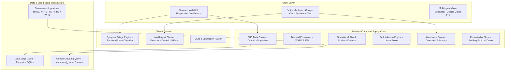

# DocMindX AI — System Architecture & National-Scale Engineering

DocMindX AI is an enterprise-grade clinical healthcare intelligence and public health supply chain management platform designed for India's Primary Health Centre (PHC) and Community Health Centre (CHC) network.

Built for the **"Build with AI: Code for Communities"** Google Cloud Hackathon (Track 03 — *National-scale health resource & supply chain management for Primary Health Centres*).

---

## 1. High-Level System Architecture

---

## 2. National-Scale Data Path (Local-First + BigQuery at Scale)

### Architecture Rationale: Why Local-First + BigQuery?
In nationwide public health deployments across 30,000+ PHCs and 700+ district headquarters, network connectivity is frequently intermittent, especially in rural and flood-affected geographies. A monolithic cloud-only architecture introduces unacceptable latency and single-point-of-failure vulnerabilities during natural disasters.

DocMindX AI implements a deliberate **Dual-Tier Hybrid Architecture**:

1. **Edge-Local Resilience (Demo Speed & Field Autonomy)**:
   - Facilities and district command stations operate locally using high-performance, compressed **Apache Parquet** columnar stores and in-memory caches.
   - All forecasting models, deterministic stockout risk rules, and transfer solvers execute client-side in under 15 milliseconds without external network calls.
   - Zero-crash offline guarantee: If internet connectivity drops or API keys are unconfigured, DocMindX AI remains 100% operational.

2. **Google Cloud BigQuery (National Scale Aggregation & Multi-Day Trends)**:
   - When configured, daily facility snapshots and multi-day demand predictions are streamed asynchronously into **Google Cloud BigQuery** (`command_center` dataset).
   - **Partitioning Strategy**: Tables (`facility_daily_snapshot`, `demand_forecast_history`) are partitioned by `DATE(snapshot_date)` to allow high-throughput querying over 30 to 730 day horizons with minimal scan costs.
   - **Clustering Strategy**: Tables are clustered by `state`, `district`, and `facility_type`, allowing sub-second analytical aggregations across all 36 States/UTs simultaneously.
   - **SQL Schema**: Defined in [`docs/bigquery_schema.sql`](file:///c:/Users/DAKSH/Music/DocMindX-AI/docs/bigquery_schema.sql).

---

## 3. Data Provenance & Zero Hardcoded Numbers Philosophy

DocMindX AI enforces absolute scientific transparency. Every metric, record, and alert surfaces its provenance tag:

| Provenance Tag | Meaning | Data Source |
|---|---|---|
| `PROVENANCE_OBSERVED` | Direct official public health data | MoHFW HMIS 2019-20, Rajya Sabha Session 266 (AU_911), WHO Disease Outbreak News |
| `PROVENANCE_REFERENCE` | Clinical reference formulary & norms | National List of Essential Medicines (NLEM 2022), IPHS 2022 Norms |
| `PROVENANCE_DERIVED` | Statistically computed operational baseline | Pincode geocoding centroids, HMIS consumption velocities |
| `PROVENANCE_SIMULATED` | Transparently labeled simulation layer | AttendanceEngine (grounded in official headcounts), FedAvg Node demonstration |
| `PROVENANCE_FORECAST` | Machine learning prediction | Scikit-Learn Random Forest Regressor (WAPE 6.53%, Held-out R² = 0.9839) |
| `PROVENANCE_RECOMMENDATION` | Algorithmic optimization suggestion | Redistribution linear solver (generates official transfer manifests) |

---

## 4. Multilingual Voice & Accessibility Infrastructure

Powered by official **Google Cloud Speech-to-Text** and **Google Cloud Text-to-Speech**:
- **Speech-to-Text**: Low-latency voice input in Hindi (`hi-IN`), Gujarati (`gu-IN`), English (`en-IN`), and regional dialects. Direct audio recording via Streamlit `st.audio_input` with zero JS overhead.
- **Text-to-Speech**: Synthesizes clinical instructions and triage summaries into natural browser audio.
- **Defensive Fallback**: If Google Cloud credentials are unavailable, automatically switches to lightweight local fallback (`SpeechRecognition` / `gTTS`) without throwing UI errors.

---

## 5. Security, ABDM & HIPAA Compliance

- Zero hardcoded credentials; centralized configuration via `config/settings.py` and `.env`.
- Local medical records encrypted in SQLite historical vault.
- Federated Learning architecture prevents raw patient or operational telemetry from leaving state health node jurisdictions.
